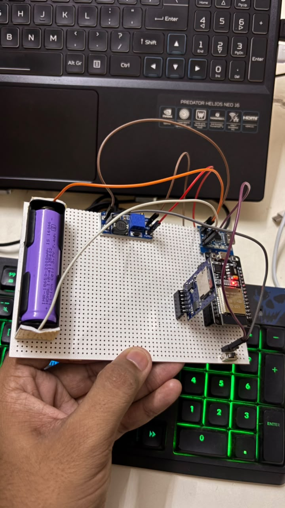
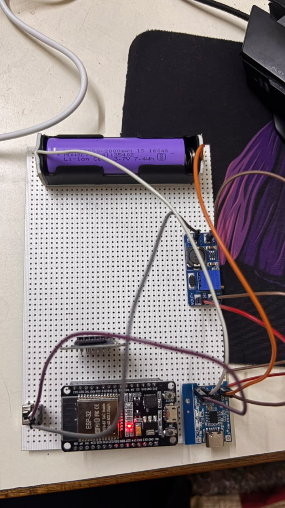
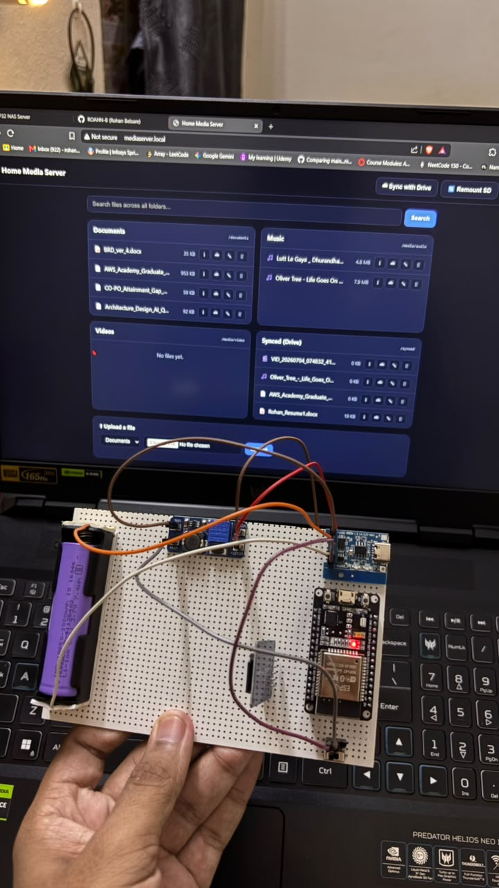

# 📁 ESP32 Home NAS with Google Drive Sync

A portable **ESP32-based Network Attached Storage (NAS)** that allows users to upload, download, stream, and synchronize files with **Google Drive** over Wi-Fi. The project uses an **ESP32**, **MicroSD Card**, and an **Async Web Server** to provide a lightweight cloud-enabled file server.

---

## 📷 Project Overview

This project transforms an ESP32 into a portable NAS that can:

- 📂 Store files on a MicroSD card
- 🌐 Access files through a web browser
- 🔐 Password-protected interface
- 🎵 Stream audio files
- 🎬 Stream video files
- 📄 Download documents
- ☁️ Synchronize files with Google Drive
- 🔄 Upload files from browser to SD card
- 📱 Access from PC or Mobile
- 🔋 Battery-powered operation (using Li-ion battery)

---

## Images and Video 





## ✨ Features

### File Management
- Upload files from browser
- Download files
- Browse folders
- Organize files into
  - Documents
  - Music
  - Videos
  - Synced Files

### Google Drive Integration
- OAuth2 Authentication
- Automatic Access Token Refresh
- Download new files from Google Drive
- Upload local files to Google Drive
- One-click synchronization

### Media Server
- Audio Streaming
- Video Streaming
- Supports HTTP Range Requests (video seeking)

### Security
- HTTP Basic Authentication
- Password protected file access

### Networking
- Wi-Fi Connectivity
- mDNS Support
- Access using

```
http://mediaserver.local
```

instead of IP address.

---

# 🛠 Hardware Used

| Component | Quantity |
|-----------|---------|
| ESP32 DevKit V1 | 1 |
| MicroSD Card Module | 1 |
| MicroSD Card | 1 |
| Li-ion Battery (18650 or Li-Po) | 1 |
| IP5306 Power Management Module *(Recommended)* | 1 |
| USB Type-C Cable | 1 |
| ON/OFF Switch | 1 |

---

# 📂 Folder Structure

```
SD Card
│
├── documents
│
├── media
│   ├── audio
│   └── video
│
└── synced
```

---

# ⚙️ Pin Connections

| ESP32 Pin | SD Card Module |
|-----------|----------------|
| GPIO23 | MOSI |
| GPIO19 | MISO |
| GPIO18 | SCK |
| GPIO5 | CS |
| VIN | VCC |
| GND | GND |

---

# 🔋 Battery Connections

```
USB Type-C
      │
      ▼
IP5306 Module
      │
      ├── BAT+ → Battery +
      ├── BAT- → Battery -
      │
      ├── OUT+ → ESP32 VIN
      └── OUT- → ESP32 GND
```

The SD Card module is powered from the ESP32 VIN pin.

---

# 🌐 Web Interface

The browser interface allows users to

- Browse files
- Download files
- Upload files
- Stream media
- Synchronize with Google Drive
- Remount SD card

---

# ☁ Google Drive Sync

The NAS synchronizes with a dedicated Google Drive folder.

### Download

Downloads files from Google Drive that do not exist locally.

### Upload

Uploads new local files to Google Drive.

Synchronization uses

- OAuth2 Refresh Token
- Google Drive REST API
- Resumable Uploads

---

# 🔐 Authentication

The web interface uses HTTP Basic Authentication.

```cpp
Username : admin
Password : ********
```

---

# 🚀 Installation

## 1. Clone Repository

```bash
git clone https://github.com/yourusername/ESP32-Home-NAS.git
```

---

## 2. Install Libraries

Install the following libraries in Arduino IDE.

- ESPAsyncWebServer
- AsyncTCP
- ArduinoJson
- SD
- SPI
- WiFi
- HTTPClient
- ESPmDNS

---

## 3. Configure Wi-Fi

```cpp
const char* WIFI_SSID = "Your WiFi";
const char* WIFI_PASSWORD = "Password";
```

---

## 4. Configure Authentication

```cpp
const char* AUTH_USERNAME = "admin";
const char* AUTH_PASSWORD = "password";
```

---

## 5. Configure Google Drive

```cpp
CLIENT_ID
CLIENT_SECRET
REFRESH_TOKEN
FOLDER_ID
```

---

## 6. Upload Code

Select

```
Board:
ESP32 Dev Module
```

Upload the sketch.

---

# 📸 Screenshots

Add screenshots here.

```
Home Page

File Upload

Media Streaming

Google Drive Sync
```

---

# Future Improvements

- Automatic Background Sync
- Multiple User Accounts
- HTTPS Support
- File Search
- File Rename/Delete
- File Preview
- Storage Statistics
- OLED Display
- Mobile App
- OTA Firmware Updates
- Deep Sleep Mode
- NAS Health Monitoring
- Real-Time Sync Notifications

---

# Tech Stack

- ESP32
- Arduino Framework
- ESPAsyncWebServer
- Google Drive REST API
- OAuth2
- ArduinoJson
- SPI
- SD Library
- HTML/CSS

---

# Project Workflow

```
             Wi-Fi
               │
               ▼
      ┌─────────────────┐
      │ ESP32 Web Server│
      └─────────────────┘
        │      │      │
        │      │      │
        ▼      ▼      ▼
   SD Storage  Browser  Google Drive
        │                 ▲
        └──────Sync────────┘
```

---

# Applications

- Portable NAS
- Home Media Server
- IoT File Server
- Offline File Sharing
- Backup Storage
- Personal Cloud
- Educational Projects

---

# License

This project is licensed under the MIT License.

---

# Author

**Rohan Belsare**

B.Tech Electronics & Computer Engineering

Walchand Institute of Technology, Solapur

GitHub: https://github.com/ROAHN-B

---

⭐ If you like this project, consider giving it a Star!
